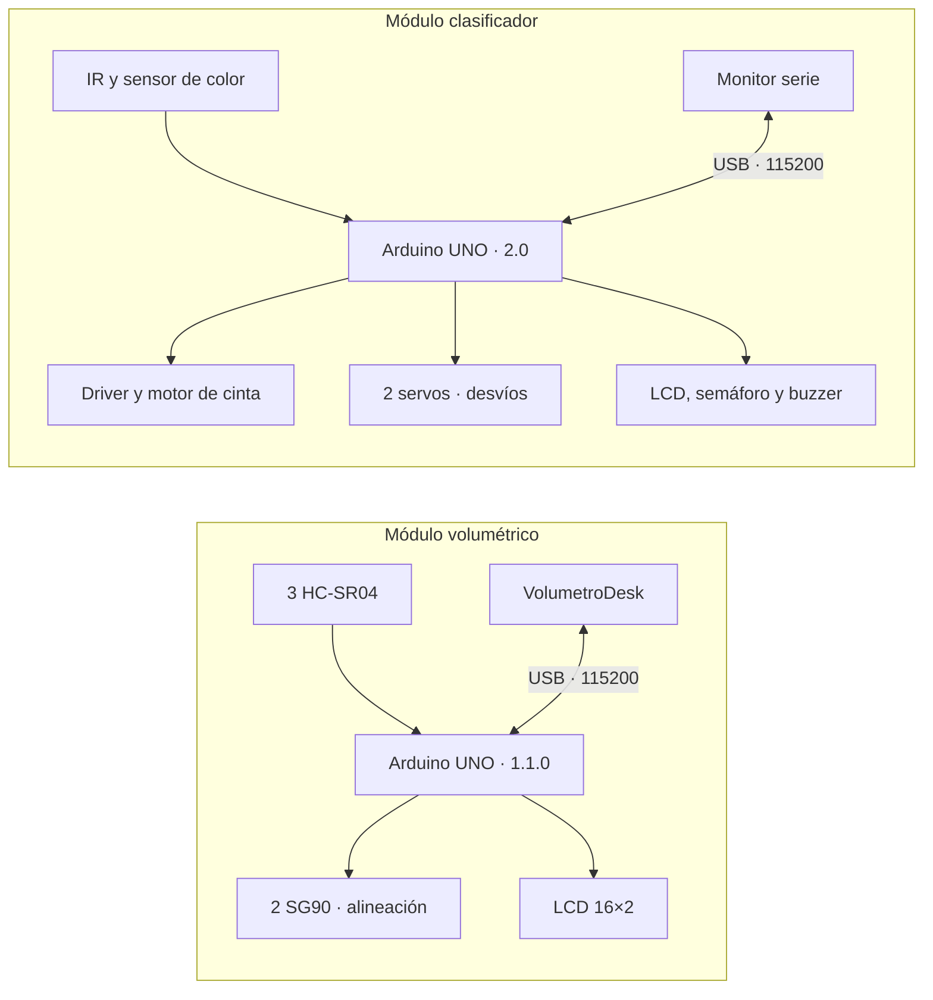

# Robótica modular: medición y clasificación

Dos proyectos educativos independientes basados en **Arduino UNO**: un sistema que mide el volumen exterior de un prisma rectangular y una cinta que clasifica objetos por color. Este repositorio reúne el código, las pruebas y la documentación necesaria para comprender y presentar cada sistema.

| Módulo | Qué resuelve | Código y documentación |
|---|---|---|
| **Medición volumétrica — CELE** | Estima largo, ancho, altura y volumen mediante tres HC-SR04; dos SG90 alinean el objeto. | [Guía completa](volumetrico/README.md) · [Firmware 1.1.0](volumetrico/Volumetrico_UNO/Volumetrico_UNO.ino) |
| **Cinta clasificadora — SCS** | Detecta la llegada de un objeto, reconoce su color y activa un desvío. | [Guía completa](cinta-clasificadora/README.md) · [Firmware 2.0](cinta-clasificadora/conveyor/conveyor.ino) |

**Cada módulo usa su propio programa, pinout y calibración.** No se cargan ambos firmwares a la vez en un UNO. Para operar los sistemas simultáneamente se necesitan dos controladores. Compartir repositorio no implica que exista comunicación entre ellos.

## Recorrido recomendado

1. Leer la [arquitectura y separación de módulos](docs/ARQUITECTURA.md).
2. Abrir la guía del módulo elegido para revisar conexiones, dependencias y puesta en marcha.
3. Compilar y ejecutar sus pruebas antes de acoplar la mecánica.
4. Consultar la [guía para explicar y demostrar los proyectos](docs/EXPLICACION.md).
5. Registrar resultados reales en la [planilla de pruebas de banco](docs/PRUEBAS_DE_BANCO.md).

## Organización

```text
volumetrico/
  Volumetrico_UNO/          Firmware principal: medición, servos, LCD y EEPROM
  Test_Ultrasonicos_Vivo/   Diagnóstico independiente de ecos y distancias
  VolumetroDesk/            App Windows: medición, calibración y secuencias
  README.md                Conexiones y guía del módulo
cinta-clasificadora/
  conveyor/                Firmware principal: detección y clasificación
  conveyor_test/           Pruebas de componentes y calibración de colores
  README.md                Conexiones y guía del módulo
docs/                      Arquitectura, exposición y pruebas
.github/workflows/         Compilación y pruebas automatizadas
```



## Preparar el entorno

Usar Arduino IDE con la placa **Arduino UNO**, o Arduino CLI. Dependencias con las que se comprobó la compilación:

```sh
arduino-cli core update-index
arduino-cli core install arduino:avr@1.8.8
arduino-cli lib install "Servo@1.3.0" "LiquidCrystal I2C@1.1.2"
```

`Wire`, `EEPROM` y las cabeceras AVR pertenecen al core. Compilar desde la raíz del repositorio:

```sh
arduino-cli compile --fqbn arduino:avr:uno volumetrico/Volumetrico_UNO
arduino-cli compile --fqbn arduino:avr:uno volumetrico/Test_Ultrasonicos_Vivo
arduino-cli compile --fqbn arduino:avr:uno cinta-clasificadora/conveyor
arduino-cli compile --fqbn arduino:avr:uno cinta-clasificadora/conveyor_test
```

Para la app del volumétrico, con Python 3.13:

```sh
python -m pip install -r volumetrico/VolumetroDesk/requirements.txt
python volumetrico/VolumetroDesk/app.py
```

VolumetroDesk es compatible con el firmware volumétrico **1.1.0**, no con el de la cinta ni con los sketches independientes de test. La [guía de la app](volumetrico/VolumetroDesk/GUIA.md) explica calibración, EEPROM y diseño de movimientos. Los ejecutables y ZIP se generan localmente en `Entregas/`; no forman parte del historial Git.

## Evidencia y límites

Comprobación local del **8 de octubre de 2026**:

| Programa | Flash | RAM estática | Resultado |
|---|---:|---:|---|
| Volumétrico principal | 17.918 B · 55 % | 855 B · 41 % | Compila para UNO |
| Test ultrasónicos | 9.050 B · 28 % | 566 B · 27 % | Compila para UNO |
| Cinta principal | 24.624 B · 76 % | 1.563 B · 76 % | Compila; aviso de poca RAM libre |
| Test cinta | 19.980 B · 61 % | 1.173 B · 57 % | Compila para UNO |

Las **17 pruebas de software de VolumetroDesk** pasan con transporte simulado. El portable y el arranque nativo se comprobaron localmente el 6 de octubre. La compilación, la simulación y el arranque de una app no confirman exactitud de medición, movimiento, estabilidad eléctrica ni persistencia física de EEPROM.

La cinta principal deja **485 bytes** para pila y variables locales: mantener visible esa restricción al añadir funciones y comprobar estabilidad prolongada en banco. Los firmwares se incorporan sin modificar su lógica. Consultar [limitaciones y criterios de prueba](docs/PRUEBAS_DE_BANCO.md).

## Desarrollo y atribución

Los cambios deben indicar a qué módulo afectan y mantener sincronizados pinout, protocolo y documentación. Ver [CONTRIBUTING.md](CONTRIBUTING.md). No se ha elegido una licencia de redistribución para el código propio; no debe asumirse una licencia abierta por estar alojado en GitHub. Las dependencias mantienen sus licencias originales.
