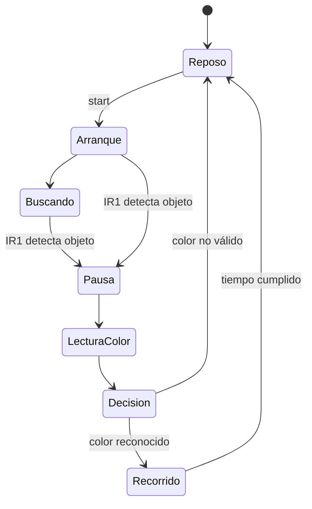

# Cinta transportadora clasificadora por color — SCS

Módulo independiente basado en Arduino UNO. Detecta un objeto con IR1, detiene la cinta para observar su color, muestra la decisión y activa el recorrido de salida con el desvío correspondiente.

- [Firmware principal v2.0](conveyor/conveyor.ino).
- [Sketch de calibración y pruebas](conveyor_test/conveyor_test.ino).
- [Volver a la portada](../README.md).

## Funcionamiento implementado



El disparo del ciclo se basa en **IR1**, no en el HC-SR04. El ultrasonido proporciona distancia cuando se detecta al arrancar. IR2 es opcional y está deshabilitado inicialmente (`hayIR2=false`).

| Resultado | Acción del programa actual |
|---|---|
| Rojo | Sigue recto; recorrido final de 3 s |
| Verde o amarillo | Acciona servo 1; comparten el mismo desvío |
| Azul | Acciona servo 2 |
| Ninguno / no válido | Detiene la cinta y vuelve a reposo |

El recorrido desviado dura inicialmente 6 s. Al completarlo se ordena reposo a ambos servos, se detiene el motor y se incrementa el contador del color. El programa no inicia otro ciclo sin una nueva orden `start`.

## Componentes y pinout

Pinout obtenido del código, idéntico entre principal y test:

| Señal | Pin UNO |
|---|---|
| Driver motor ENA (PWM) | D5 |
| Driver motor IN1 / IN2 | D7 / D8 |
| Servo 1 / servo 2 | D10 / D11 |
| HC-SR04 TRIG / ECHO | D13 / D12 |
| IR1 / IR2 opcional | D2 / A3 |
| Sensor color S2 / S3 / OUT | A0 / A1 / D4 |
| Semáforo rojo / amarillo / verde | D9 / D6 / A2 |
| Buzzer | D3 |
| LCD I²C SDA / SCL | A4 / A5 |

LCD: 16×2, dirección `0x27`. El sensor de color se maneja mediante selección S2/S3 y medida de frecuencia en OUT (familia TCS230/TCS3200); confirmar el módulo físico. **S0 y S1 no se controlan en el código**: su conexión/escala de frecuencia debe definirse y documentarse en el montaje antes de calibrar. El código por sí solo no establece ese cableado.

El driver se identifica como L298N en el sketch de test. La versión principal se configura para una demostración con alimentación de motor de 12 V; el campo `volt` es informativo y no regula el voltaje. Usar fuente apropiada al motor/driver, alimentación regulada para los servos y GND común. No alimentar motor ni servos desde el regulador del UNO. Si se usa ENA por PWM en un L298N, el jumper de ENA no debe puentear ese control.

## Arranque y diferencias respecto al volumétrico

Al arrancar, la cinta detiene el motor pero **acopla ambos servos y ordena sus ángulos de reposo**: 105° y 100° en el principal; 90° y 90° en el test. La primera carga se debe realizar con espacio mecánico libre.

`stop` detiene el motor y vuelve a reposo lógico; **no desacopla ni devuelve automáticamente los servos a su posición de reposo**. No equivale al `STOP` del módulo volumétrico ni a una desconexión eléctrica.

## Puesta en marcha por monitor serie

1. Instalar Servo 1.3.0 y LiquidCrystal I2C 1.1.2, seleccionar UNO y el puerto correcto.
2. Cargar primero `conveyor_test.ino`, con motor y mecanismos preparados para una prueba supervisada.
3. Abrir el monitor a **115200 baudios**, con nueva línea. Enviar `status`, `ir`, `us`, `color` para comprobar lecturas.
4. Calibrar todos los colores como se indica abajo.
5. Volver a cargar `conveyor.ino`; comprobar `status`. Usar `json off` si se desea reducir la salida del monitor.
6. Ejecutar `start`, introducir un solo objeto y observar el ciclo completo. Usar `stop` para detener la cinta.

### Calibración de color con el sketch de test

Colocar cada muestra en la misma posición, distancia e iluminación que tendrá durante la clasificación. Enviar un comando con la muestra correspondiente presente:

```text
calibrar rojo
calibrar verde
calibrar azul
calibrar amarillo
calibrar mostrar
```

Los cuatro comandos no se ejecutan sobre una misma muestra: hay que reemplazarla entre comandos. Cada referencia se guarda inmediatamente en EEPROM. Completar las cuatro antes de evaluar; el indicador de calibración no valida que todas se hayan tomado correctamente. Al cargar nuevamente el principal, recupera esas referencias.

La comparación utiliza diferencias entre las lecturas R/G/B y las referencias; no es reconocimiento visual por cámara. Verde y amarillo tienen contadores diferentes, pero el programa actual los dirige al mismo servo.

### Comandos principales

| Comando | Propósito |
|---|---|
| `?` | Ayuda |
| `status` | Estado y lecturas |
| `start` / `stop` | Iniciar un ciclo / detener motor y ciclo |
| `json on` / `json off` | Activar/desactivar telemetría periódica |
| `color` / `evaluar` | Lectura y evaluación de color |
| `ir` / `us` | Consultar sensores |
| `test on` / `test off` | Entrar/salir del modo de pruebas |
| `motor off` | Detener el motor |
| `motor on 180` | Ejemplo de accionamiento a PWM 180, no una velocidad universal |
| `servo 1 105` | Ejemplo de orden angular para servo 1 |

Los comandos son propios de la cinta. VolumetroDesk no interpreta este protocolo. El principal también implementa comandos y telemetría JSON; su parser busca cadenas concretas y no es un parser JSON general. Para una futura interfaz, consultar `procesarJSON`, `procesarTest` y `enviarJSON` antes de emitir comandos.

## EEPROM y límites

Las referencias de color usan la marca `0xAA` en dirección 0 y bloques de tres enteros por color; amarillo añade la marca `0x53` en dirección 25. No es el formato de EEPROM del volumétrico. Cambiar de sistema en la misma placa requiere volver a cargar la calibración adecuada.

La compilación del principal deja 485 bytes de RAM para pila y variables locales. El ensayo de funcionamiento prolongado está pendiente en esta entrega. La clasificación y los tiempos de recorrido deben comprobarse con la cinta real: dependen de iluminación, posición, dimensiones, fricción y velocidad efectiva.

## Compilar

Desde la raíz del repositorio:

```sh
arduino-cli compile --fqbn arduino:avr:uno cinta-clasificadora/conveyor
arduino-cli compile --fqbn arduino:avr:uno cinta-clasificadora/conveyor_test
```

Registrar resultados en la [guía de pruebas](../docs/PRUEBAS_DE_BANCO.md). Esta documentación describe el código incluido; no certifica el funcionamiento físico del montaje.
